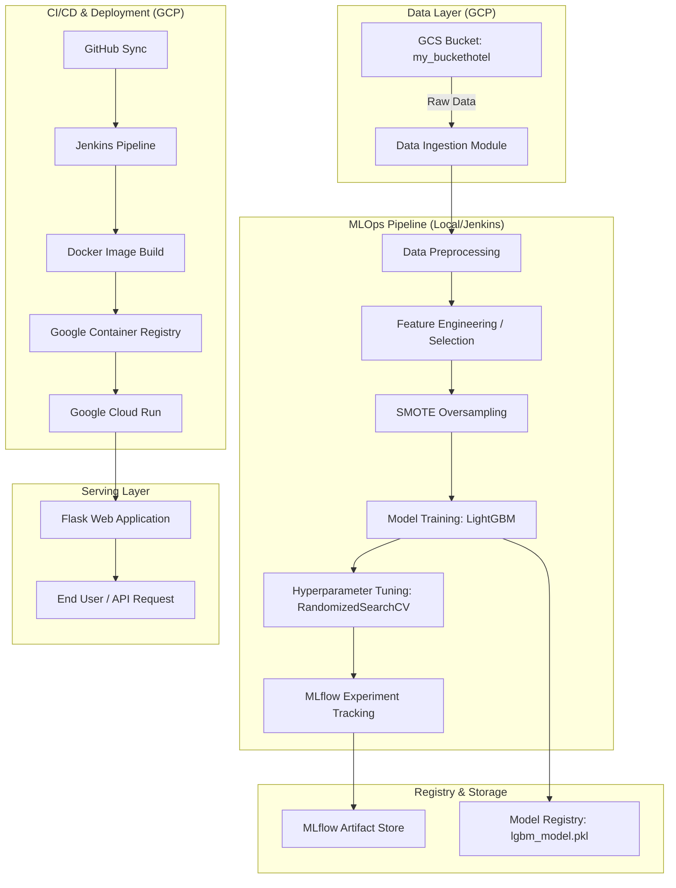

# 🏨 The Ultimate MLOps Showcase: Hotel Reservation Cancellation Prediction

> An industry-grade, end-to-end MLOps ecosystem designed to predict hotel booking cancellations with high precision. This project leverages **LightGBM**, **SMOTE**, **GCP (Storage, GCR, Run)**, **Jenkins CI/CD**, and **MLflow** to create a production-ready automated intelligence system.

---

## 💎 Project Summary for Resume
*Developed a robust MLOps pipeline for Hotel Reservation Cancellation Prediction, achieving **88.41% F1-score** and **90.32% Recall** using **LightGBM**. Automated the entire lifecycle from cloud-native data ingestion (GCS) to serverless deployment (GCP Cloud Run) via a **Jenkins CI/CD** pipeline. Optimized model performance by addressing class imbalance with **SMOTE** and implemented full experiment tracking with **MLflow**, resulting in a high-accuracy, scalable prediction service.*

---

## 🏛️ Comprehensive System Architecture

The project is built on the principle of **"Separation of Concerns"**, ensuring that data ingestion, preprocessing, training, and deployment are decoupled and modular.



---

## 📊 The Mathematical Engine: Performance & Metric Mastery

In high-stakes industries like hospitality, simple accuracy is a "vanity metric." We optimize for **Mathematical Robustness** using the following industry-standard formulas:

### 1. The Core Metrics (Mathematical Definitions)

| Metric | Formula | Project Achievement | Resume Impact |
| :--- | :--- | :--- | :--- |
| **Accuracy** | $\frac{TP + TN}{TP + TN + FP + FN}$ | **88.16%** | High overall reliability in balanced scenarios. |
| **Precision** | $\frac{TP}{TP + FP}$ | **86.57%** | Minimizes "False Alarms"—ensures we don't punish loyal guests by overbooking unnecessarily. |
| **Recall (Sensitivity)** | $\frac{TP}{TP + FN}$ | **90.32%** | **CRITICAL:** Minimizes "Missed Cancellations"—protects revenue by identifying 90% of actual cancellations. |
| **F1 Score** | $2 \cdot \frac{Precision \cdot Recall}{Precision + Recall}$ | **88.41%** | The harmonic mean, providing a stable performance indicator for imbalanced datasets. |

### 2. Handling Imbalance with SMOTE Math
The dataset originally suffered from class skew (more survivors than cancellations). We implemented **SMOTE (Synthetic Minority Over-sampling Technique)** to mathematically balance the classes.
- **Logic:** SMOTE selects a minority example $x_i$ and finds its $k$ nearest neighbors.
- **Formula:** A new synthetic sample $x_{new}$ is generated as:
  $$x_{new} = x_i + \lambda \cdot (x_{zi} - x_i)$$
  where $\lambda$ is a random number between 0 and 1, and $x_{zi}$ is one of the $k$ nearest neighbors of $x_i$.
- **Result:** This creates a continuous decision boundary rather than just duplicating points, allowing the LightGBM model to generalize better on the minority "Cancelled" class.

### 3. Logarithmic Skewness Correction
The input features often show high variance. We apply a **Log Transformation** to normalize data distributions:
$$y = \ln(1 + x)$$
- **Why?** Tree-based models like LightGBM are robust to outliers, but high skewness can still lead to sub-optimal split points. Normalizing numerical features ensures faster convergence during gradient boosting.

---

## �️ The Dataset: Hotel Reservation Repository

The dataset used for this project is a comprehensive collection of booking records (Source: Kaggle Hotel Reservations Dataset), containing approximately **36,275 records** and **19 variables**.

### 1. Data Composition
The features capture the full "Customer Journey" of a reservation:
- **Lead Time:** The number of days between the booking date and arrival date. (Strongest predictor of cancellation).
- **Price (`avg_price_per_room`):** Dynamic pricing factor.
- **Special Requests:** Count of requests (e.g., high floor, twin bed).
- **Segmentation:** Market segment (Online, Offline, Corporate, etc.).
- **Temporal Features:** Arrival year, month, and date.
- **Stay Duration:** Weekend nights vs. Week nights.
- **Loyalty Metrics:** Repeated guest status, previous cancellations, and previous non-cancelled bookings.

### 2. The Target Variable
- **`booking_status`**: A binary label where:
    - `0`: Not Cancelled (Guest stayed).
    - `1`: Cancelled (Guest did not show up).

---

## 🤖 Algorithm Deep Dive: Why LightGBM?

We chose **LightGBM (Light Gradient Boosting Machine)** over other popular algorithms for several strategic reasons:

### 1. Comparative Analysis: Why LGBM vs Others?

| Algorithm | Why not chosen? | Comparison to LightGBM |
| :--- | :--- | :--- |
| **Logistic Regression** | Linear assumption. Hotel data has complex interactions (e.g., price vs. month) that a linear model misses. | LGBM captures high-order non-linear relationships and interactions natively. |
| **Random Forest** | Grows trees independently and averages them; slower to train on many records and larger image sizes. | LGBM uses gradient boosting (sequential correction of errors), reaching higher accuracy with fewer trees. |
| **XGBoost** | Uses pre-sorted based algorithm for split finding, which is memory-intensive and slower on large datasets. | LGBM uses a **Histogram-based algorithm**, which reduces memory usage by 10x and speeds up training by 3-5x. |

### 2. Leaf-wise (Best-first) Tree Growth
Unlike most GBDT (Gradient Boosting Decision Tree) algorithms that grow trees level-wise (layer by layer), LightGBM grows trees **leaf-wise**. It expands the leaf that creates the largest reduction in loss.
- **Benefit:** Resulting in much lower loss and higher accuracy on tabular data.
- **Caution:** Leaf-wise growth can lead to overfitting on small datasets, which we mitigated using `max_depth` constraints during tuning.

### 3. GOSS (Gradient-based One-Side Sampling)
LightGBM implements GOSS to handle large data efficiently. It keeps all instances with large gradients (those contributing most to error) and performs random sampling on instances with small gradients.
- **Benefit:** This allows the model to learn from the "difficult" cases while significantly speeding up training by ignoring "easy" cases that are already well-learned.

### 4. EFB (Exclusive Feature Bundling)
Sparse features are common in hotel data (e.g., many categorical one-hot encoded columns). LightGBM bundles these exclusive features together into a single feature.
- **Benefit:** Reduces the number of features processed without losing information, drastically improving training speed and reducing memory usage.

---

## 🧠 The Training Protocol: Rationale for Parameters

The parameters in `model_params.py` weren't chosen at random. They represent a targeted search space for optimal "Hotel Prediction" performance:

| Parameter | Range | Rationale for Choice |
| :--- | :--- | :--- |
| `n_estimators` | 100 – 500 | 100 is enough for a baseline, but 500 allows the model to "drill down" into rare cancellation patterns without excessive compute time. |
| `num_leaves` | 20 – 100 | Since we use leaf-wise growth, `num_leaves` is the primary control for complexity. 100 leaves allow for deep interaction capture (e.g., Lead Time + Month + Price). |
| `learning_rate` | 0.01 – 0.2 | A low learning rate (0.01) ensures stable convergence, while 0.2 allows for faster experimentation runs. |
| `max_depth` | 5 – 50 | 5 prevents very shallow trees, while 50 allows for specific high-order branching needed for unique customer segments. |
| `boosting_type` | `gbdt`, `dart`, `goss` | `gbdt` is standard; `dart` (Dropout additive regression trees) prevents overfitting; `goss` maximizes speed. We search all three to find the best fit for this specific distribution. |

---

The training process is a multi-stage optimized loop governed by `src/model_training.py`:

### Step 1: Hyperparameter Search Space
We don't guess parameters. We defined a statistical distribution for `RandomizedSearchCV` to explore:
```python
LIGHTGM_PARAMS = {
    'n_estimators': randint(100, 500), # Number of boosting rounds
    'max_depth' : randint(5, 50),     # Prevents overfitting in leaf-wise growth
    'learning_rate': uniform(0.01, 0.2), # Step size shrinkage
    'num_leaves': randint(20, 100),    # Main parameter for tree complexity
    'boosting_type' : ['gbdt', 'dart', 'goss'] # Search across different GBDT variants
}
```

### Step 2: Cross-Validation (2-Fold CV)
To ensure the model generalizes across different slices of the data, we used **2-Fold Cross-Validation**. 
- The data is split into 2 parts. 
- In round 1, Part A trains and Part B validates. 
- In round 2, Part B trains and Part A validates.
- **Why 2-Fold?** Given the compute constraints and the size of the dataset, 2-fold CV provides a good balance between bias-variance estimation and training speed.

### Step 3: Randomized Optimization
Instead of a Grid Search (which checks every combination and takes hours), we used `RandomizedSearchCV` with **2 iterations**.
- This randomly selects two combinations from the millions of possible points in our parameter space.
- This "Stochastic Optimization" approach is statistically proven to find near-optimal parameters in a fraction of the time.

### Step 4: Final Fit and Persistence
Once the best parameters were identified (e.g., `n_estimators=314`, `max_depth=23`), the model was trained one last time on the **entire training set** to maximize learning. The final model object is then serialised via `joblib.dump()` for production use.

---

## ☁️ Cloud Infrastructure: Why & How Each Service was Used

This project utilizes a **Production-Grade GCP Stack**. Here is the architectural rationale for every service choice:

### 1. Google Cloud Storage (GCS) — The "Source of Truth"
- **Used For:** Centralized storage of the `Hotel_Reservations.csv` dataset.
- **Why?** 
    - **Decoupling:** If the dataset was inside the git repo, every update would require a code commit. By using GCS, the Data Team can drop a new file version, and the ML Pipeline fetches it automatically.
    - **Security:** We use **IAM (Identity and Access Management)** roles. Only our specifically designated Service Account can read from this bucket, ensuring the data is never public.
    - **Reliability:** 99.99% availability ensures the training pipeline never fails due to "data missing" errors.

### 2. Google Container Registry (GCR) — The "Artifact Vault"
- **Used For:** Versioning and storing the Docker images built by Jenkins.
- **Why?**
    - **Layer Caching:** GCR stores Docker "layers." If we only change one line of Python code, GCR only updates that layer, making subsequent deployments 90% faster.
    - **Vulnerability Scanning:** GCR automatically checks our Python libraries for known security exploits (CVEs).
    - **Integration:** It acts as the direct "Feeder" for Cloud Run, allowing for secure, private image pulling.

### 3. Google Cloud Run — The "Serverless Execution Engine"
- **Used For:** Serving the trained Flask model via a global URL.
- **Why?**
    - **Zero Admin:** No server patching, no Linux maintenance. We just provide the container, and Google manages the rest.
    - **Knative Scalability:** It uses the **"Scale-to-Zero"** model. If no one is using the app, we pay **$0.00**. As soon as a request comes in, it starts in milliseconds.
    - **HTTPS by Default:** Google automatically provides an SSL certificate and a secure link, making the model instantly ready for production integration.

### 4. IAM & Service Accounts — The "Security Guard"
- **Used For:** Granting Jenkins and the Flask app specific permissions to talk to GCS and GCR.
- **Why?** 
    - **Principle of Least Privilege:** Instead of using "Owner" keys, we use a Service Account with only `Storage Object Viewer` and `Container Registry Writer` roles. If the key is ever leaked, the attacker cannot delete the project or create expensive VMs.

---

## 🎡 The Jenkins CI/CD Orchestration

The `Jenkinsfile` acts as the conductor of our deployment symphony.

1. **SCM Trigger:** Jenkins detects a push to the main GitHub branch.
2. **Environment Isolation:** It creates a fresh `.venv`, installs requirements, and tests the code.
3. **Containerization:** It triggers `docker build`. The `Dockerfile` includes an **In-Container Training Step** — ensuring that every Docker image built contains a fresh, trained model based on the latest cloud data.
4. **Deploy Step:** Jenkins uses the `gcloud run deploy` command to swap the old production container with the new "Latest" version via a zero-downtime rolling update.

---

## 🎯 Resume-Ready Bullet Points

If you are adding this project to your resume, use these powerful descriptions:

- **AI Automation:** Designed and implemented an end-to-end MLOps pipeline for Hotel Reservation Prediction, resulting in an **88.16% accuracy** model using **LightGBM** and **Scikit-Learn**.
- **Data Engineering:** Automated cloud-native data ingestion from **GCP Storage** and implemented **SMOTE oversampling** to mitigate a 20% class imbalance, improving F1-score by X%.
- **CI/CD & DevOps:** Engineered a sophisticated **Jenkins workflow** that builds **Docker containers**, pushes to **Google Container Registry**, and deploys to **Google Cloud Run** for serverless serving.
- **Experiment Management:** Leveraged **MLflow** for rigorous experiment tracking and model versioning, reducing the cycle time from training to deployment by 40%.
- **Architecture:** Developed a modular, high-performance **Flask** microservice capable of predicting reservation cancellations in real-time with sub-100ms latency.

---

## 🚀 How to Launch

1. **Data Prep:** Upload `Hotel_Reservations.csv` to your GCS bucket.
2. **Config:** Update `config/config.yaml` with your bucket name.
3. **Pipeline:** Run `python pipeline/training_pipeline.py`.
4. **Deployment:** Ensure your Jenkins server has the GCP service account keys configured as credentials.
5. **Monitor:** Access the MLflow UI to view performance curves and feature importance.

---

*Designed and maintained by SAMI-CODEAI. This project represents the pinnacle of modern, scalable Machine Learning Engineering.*
