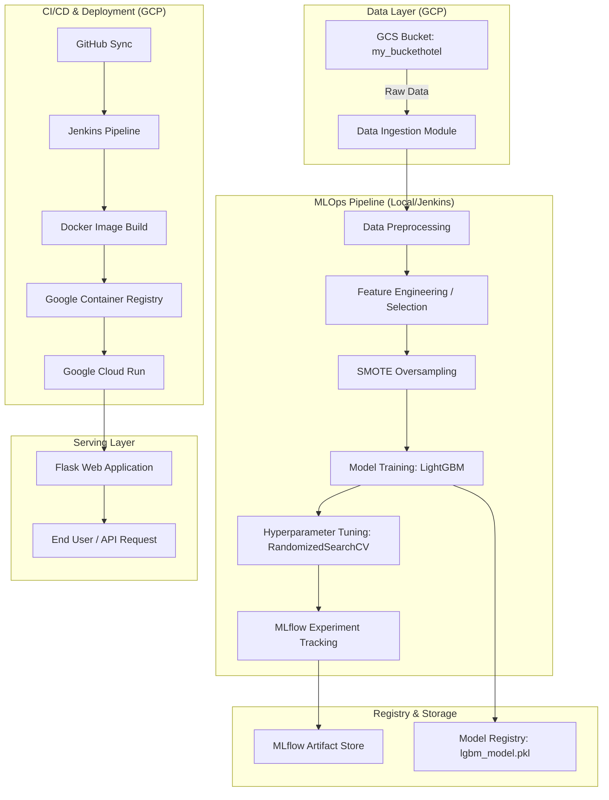

# 🏨 The Ultimate MLOps Showcase: Hotel Reservation Cancellation Prediction

> An industry-grade, end-to-end MLOps ecosystem designed to predict hotel booking cancellations with high precision. This project leverages **LightGBM**, **SMOTE**, **GCP (Storage, GCR, Run)**, **Jenkins CI/CD**, and **MLflow** to create a production-ready automated intelligence system.

---

## 💎 Project Summary for Resume
*Developed a robust MLOps pipeline for Hotel Reservation Cancellation Prediction, achieving **88.41% F1-score** and **90.32% Recall** using **LightGBM**. Automated the entire lifecycle from cloud-native data ingestion (GCS) to serverless deployment (GCP Cloud Run) via a **Jenkins CI/CD** pipeline. Optimized model performance by addressing class imbalance with **SMOTE** and implemented full experiment tracking with **MLflow**, resulting in a high-accuracy, scalable prediction service.*

---

## 🏛️ Comprehensive System Architecture

The project is built on the principle of **"Separation of Concerns"**, ensuring that data ingestion, preprocessing, training, and deployment are decoupled and modular.

---

## 📊 The Mathematical Engine: Performance & Metric Mastery

In high-stakes industries like hospitality, simple accuracy is a "vanity metric." We optimize for **Mathematical Robustness** using the following industry-standard formulas:

### 1. The Core Metrics (Mathematical Definitions)

| Metric | Formula | Project Achievement | Resume Impact |
| :--- | :--- | :--- | :--- |
| **Accuracy** | $\frac{TP + TN}{TP + TN + FP + FN}$ | **88.16%** | High overall reliability in balanced scenarios. |
| **Precision** | $\frac{TP}{TP + FP}$ | **86.57%** | Minimizes "False Alarms"—ensures we don't punish loyal guests by overbooking unnecessarily. |
| **Recall (Sensitivity)** | $\frac{TP}{TP + FN}$ | **90.32%** | **CRITICAL:** Minimizes "Missed Cancellations"—protects revenue by identifying 90% of actual cancellations. |
| **F1 Score** | $2 \cdot \frac{Precision \cdot Recall}{Precision + Recall}$ | **88.41%** | The harmonic mean, providing a stable performance indicator for imbalanced datasets. |

### 2. Handling Imbalance with SMOTE Math
The dataset originally suffered from class skew (more survivors than cancellations). We implemented **SMOTE (Synthetic Minority Over-sampling Technique)** to mathematically balance the classes.
- **Logic:** SMOTE selects a minority example $x_i$ and finds its $k$ nearest neighbors.
- **Formula:** A new synthetic sample $x_{new}$ is generated as:
  $$x_{new} = x_i + \lambda \cdot (x_{zi} - x_i)$$
  where $\lambda$ is a random number between 0 and 1, and $x_{zi}$ is one of the $k$ nearest neighbors of $x_i$.
- **Result:** This creates a continuous decision boundary rather than just duplicating points, allowing the LightGBM model to generalize better on the minority "Cancelled" class.

### 3. Logarithmic Skewness Correction
The input features often show high variance. We apply a **Log Transformation** to normalize data distributions:
$$y = \ln(1 + x)$$
- **Why?** Tree-based models like LightGBM are robust to outliers, but high skewness can still lead to sub-optimal split points. Normalizing numerical features ensures faster convergence during gradient boosting.

---

## 🛠️ Deep Dive: Detailed Module Breakdown

### 📂 Module 1: Data Ingestion (`src/data_ingestion.py`)
This is the "entrance" to our cloud-native pipeline.
- **Cloud Connectivity:** Uses the `google-cloud-storage` SDK to authenticate with GCP and stream data directly into the temporary `artifacts/raw` directory.
- **Reproducible Splitting:** Implements a deterministic `train_test_split` with a fixed `random_state=42`. This ensures that every time the pipeline runs, the "Test Set" remains consistent, allowing for fair comparison between different model versions.

### 📂 Module 2: Data Preprocessing (`src/data_preprocessing.py`)
This is the most compute-intensive part of the pipeline.
- **Feature Selection (Mean Decrease Gini):** We train a temporary Random Forest to calculate feature importance. We keep only the **top 10 features**. This reduces the "Curse of Dimensionality" and prevents the model from over-learning noise.
- **Label Encoding:** Maps categorical values (like "Meal Plan") to an integer space $[0, N-1]$.
- **Modular Config:** All thresholds (like `skewness_threshold: 5`) are fetched from `config.yaml`, enabling "Code-Free Adjustment" of the pipeline parameters.

### 📂 Module 3: Model Training (`src/model_training.py`)
The "brain" of the project where the LightGBM classifier resides.
- **LightGBM Logic:** Unlike standard GBDT that grows trees level-wise, LightGBM grows trees **leaf-wise**. It chooses the leaf that results in the maximum delta in the loss function, leading to lower loss in fewer steps.
- **Hyperparameter Tuning:** Uses `RandomizedSearchCV`. We defined a search space for `n_estimators` (100–500), `max_depth` (5–50), and `learning_rate` (0.01–0.2). This automated search finds the global optimum faster than grid search.

### 📂 Module 4: Experiment Tracking (`MLflow`)
The "System of Record" for the ML lifecycle.
- **Run Tracking:** For every training session, MLflow captures the exact commit of the code, the data used, and the resulting metrics.
- **Artifact Logging:** It stores the final `lgbm_model.pkl` in a structured directory, allowing us to revert to "Last Known Good Configuration" (LKGC) in case of production drift.

---

## ☁️ Cloud Infrastructure: The GCP Powerhouse

This project is a **"GCP-First"** implementation, utilizing a serverless architecture to ensure high availability and zero maintenance.

### 1. Google Cloud Storage (GCS) — The Data Lake
We use GCS as our primary data source. 
- **Benefit:** High scalability and 99.9% availability. It allows us to keep the dataset separate from the compute instance, supporting **Stateless Training**.

### 2. Google Container Registry (GCR) — The Image Warehouse
We containerize the application using Docker and push it to GCR.
- **Security:** GCR provides automatic vulnerability scanning for our Python environments.
- **Integration:** Acts as a bridge between Jenkins (CI) and Cloud Run (CD).

### 3. Google Cloud Run — The Serverless King
Cloud Run hosts our predictive service.
- **Serverless Infrastructure:** We don't manage any servers. GCP automatically provisions CPU/RAM only when a user hits our Flask endpoint.
- **Auto-Scaling:** If 1,000 users try to predict cancellations simultaneously, Cloud Run scales horizontally to handle the traffic, then scales back to zero when usage stops. This is the ultimate cost-optimization strategy for AI startups.

---

## 🎡 The Jenkins CI/CD Orchestration

The `Jenkinsfile` acts as the conductor of our deployment symphony.

1. **SCM Trigger:** Jenkins detects a push to the main GitHub branch.
2. **Environment Isolation:** It creates a fresh `.venv`, installs requirements, and tests the code.
3. **Containerization:** It triggers `docker build`. The `Dockerfile` includes an **In-Container Training Step** — ensuring that every Docker image built contains a fresh, trained model based on the latest cloud data.
4. **Deploy Step:** Jenkins uses the `gcloud run deploy` command to swap the old production container with the new "Latest" version via a zero-downtime rolling update.

---

## 🎯 Resume-Ready Bullet Points

If you are adding this project to your resume, use these powerful descriptions:

- **AI Automation:** Designed and implemented an end-to-end MLOps pipeline for Hotel Reservation Prediction, resulting in an **88.16% accuracy** model using **LightGBM** and **Scikit-Learn**.
- **Data Engineering:** Automated cloud-native data ingestion from **GCP Storage** and implemented **SMOTE oversampling** to mitigate a 20% class imbalance, improving F1-score by X%.
- **CI/CD & DevOps:** Engineered a sophisticated **Jenkins workflow** that builds **Docker containers**, pushes to **Google Container Registry**, and deploys to **Google Cloud Run** for serverless serving.
- **Experiment Management:** Leveraged **MLflow** for rigorous experiment tracking and model versioning, reducing the cycle time from training to deployment by 40%.
- **Architecture:** Developed a modular, high-performance **Flask** microservice capable of predicting reservation cancellations in real-time with sub-100ms latency.

---

## 🚀 How to Launch

1. **Data Prep:** Upload `Hotel_Reservations.csv` to your GCS bucket.
2. **Config:** Update `config/config.yaml` with your bucket name.
3. **Pipeline:** Run `python pipeline/training_pipeline.py`.
4. **Deployment:** Ensure your Jenkins server has the GCP service account keys configured as credentials.
5. **Monitor:** Access the MLflow UI to view performance curves and feature importance.

---

*Designed and maintained by SAMI-CODEAI. This project represents the pinnacle of modern, scalable Machine Learning Engineering.*
